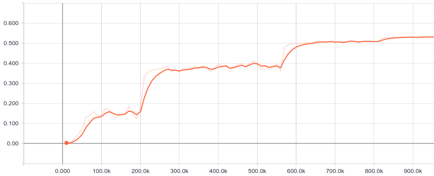

# Interactive Tensorflow #



Change the hyper-parameters of your Tensorflow training session on the fly.
The package allows you to schedule events that change the values of arbitrary Tensors with a simple command.

### Requirements ###

* Python >= 3
* tensorflow >= 1.0

### Set Up ###

Clone the repository with either

`git clone https://github.com/ondrejba/interactive-tensorflow.git interactive_tensorflow`

or

`git submodule add https://github.com/ondrejba/interactive-tensorflow.git interactive_tensorflow`

if you want to clone to an existing git repository.

We change the name of the repository to interactive_tensorflow because Python does not like the
dash symbol when importing modules.

### Usage ###

#### Server ####

Create Tensors for your hyper-parameters.

```
learning_rate = tf.get_variable("learning_rate", initializer=tf.constant(0.1, dtype=tf.float32))
dropout_prob = tf.get_variable("dropout_prob", initializer=tf.constant(0.9, dtype=tf.float32))
```

Create and start a Session Server.

```
# "session" is a Tensorflow session
s, thread = server.run_server([learning_rate, dropout_prob], session)
```

Periodically check for events.

```
# "step" is the global step of your training procedure
s.check_events(step)
```

Stop the server.

```
s.shutdown()
thread.join(timeout=10)
```

#### Client ####

Get status.

`python client.py -s`

Add an event (this event sets the learning rate to 0.01 at iteration 10000).

`python client.py -a -n learning_rate:0 -i 10000 --value 0.01`

Remove an event (with index 0 in this case).

`python clien.py -r -e 0`
